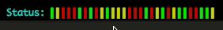

# termblock

 Little terminal colorful block lib. Convert integer array to colorful block view.

 View the [docs](http://godoc.org/github.com/doseeing/termblock).



## Installation

```
$ go get github.com/doseeing/termblock
```

## Example

```go
// Alphabet as first argument, 0 -> T, 1-> F
tb := termblock.New(`TF`)
tb.Print([]int{0,1,0,1,0,1}, "Basic Example: ")
```

## Color Example
```go
// ANSI color code as second argument
tb := termblock.ColorNew(`TF`, []int{31,32})

tb.Print([]int{0,1,0,1,0,1}, "Color Example: ")
```

## Color Block Example
```go
tb := termblock.ColorNew(`▌`, []int{31,32})
tb.Print([]int{0,1,0,1,0,1}, "Color Block Example: ")
```

## Inspired by

[tj/go-spin](https://github.com/tj/go-spin)

# License

 MIT